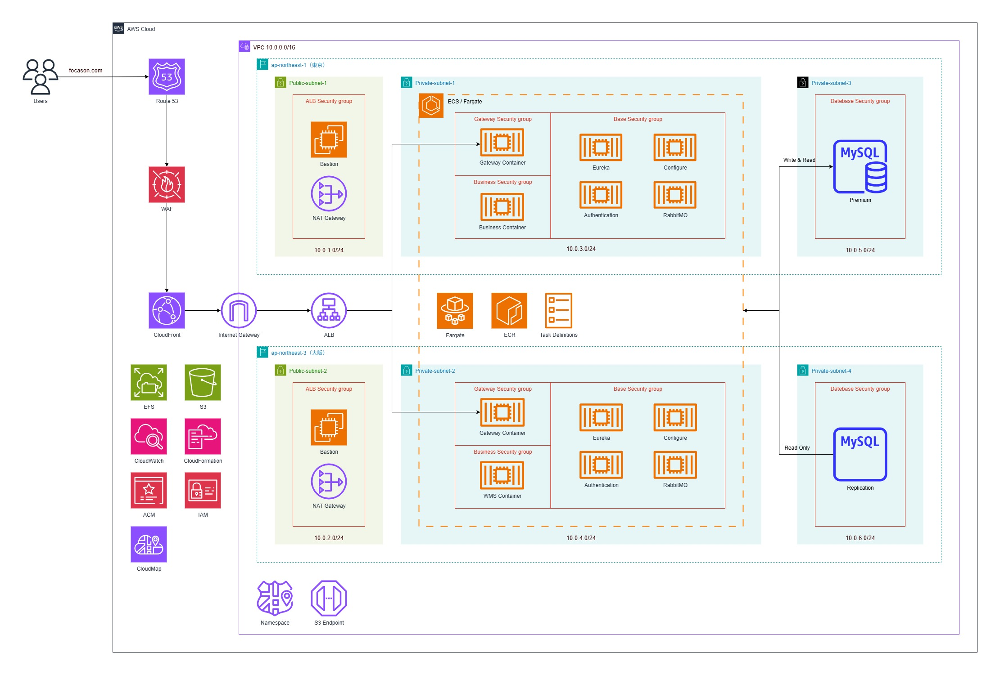

# Focason AWS Starter



## 部署前准备
### 1. 创建AWS账号
### 2. 创建IAM User，并生成Access Key
### 3. 创建Host Zone
  * 在route53中创建host zone
  * 将申请到的域名的NS转移到route53中

## 正式部署
### 1. 创建 VPC、Subnet、Security Group、ALB等
在AWS Cloudformation中执行 `001_vpc.yaml` 文件

### 2. 创建 EC2 堡垒机以及 RDS 数据库
1. 生成Key Pair
    
    在 AWS 里，EC2 KeyPair 是公钥/私钥对：
    * 公钥 存在 AWS
    * 私钥 你必须自己保存（AWS 不会保存）
    * 通常用来通过 SSH 登录 EC2 实例。
    ```bash
    ssh-keygen -t rsa -b 4096 -f [my-key]
    ```
    执行之后会生成:
    * my-key (私钥)
    * my-key.pub (公钥)

    然后你可以在 CloudFormation 模板里创建：
    ```yaml
    KeyPair:
      Type: AWS::EC2::KeyPair
      Properties:
        KeyName: !Sub "${ProjectName}-keypair"
        PublicKeyMaterial: |
          ssh-rsa AAAAB3NzaC1yc2EAAAADAQABAAABAQCuC+Xv0FQ6M0JcKkZzM... your public key ...
    ```

2. 在AWS Cloudformation中执行 `002_bastion_rds.yaml` 文件

### 3. 创建 ECS Cluster
在AWS Cloudformation中执行 `003_cluster.yaml` 文件

### 4. 创建 ECS 基础服务
* Eureka
* RabbitMQ
* Configure
* Gateway
* Authentication

在AWS Cloudformation中执行 `004_ecs_base.yaml` 文件

### 5. 创建前端服务（NUXT）
  1. 在AWS Cloudformation中执行 `005_nuxt_static_hosting.yaml` 文件
  2. 在前端项目中执行下面的命令，将文件上传到S3桶中
     ```bash
     sh deploy-nuxt-to-s3.sh
     ```

### 6. 部署后操作
* 数据库初始化
  * 修改 `focason-core` 模块中的 `gradle.properties` 中的配置信息
  * 在本地建立连接通道
    * ※参考[在本地通过堡垒机连接数据库](#在本地通过堡垒机连接数据库)
  * 执行 `Flyway Tasks`
    * 通过以下命令初始化数据库
      ```bash
      # 查看Flyway执行情况
      ./gradlew flywayInfo
      ```
      ```bash
      # 清空数据库
      ./gradlew flywayClean
      ```
      ```bash
      # 执行Pending中的DDL
      ./gradlew flywayMigrate
      ```
    * 快捷方式
      ```yaml
      Gradle -> focason-cloud -> focason-core -> Tasks -> flyway 
      ```
* 页面确认
  * https://focason.com
  * 注册用户并登录
  * 如正常访问，则部署完成

## 堡垒机
### 组件最新化
* EC2 インスタンスのソフトウェアを更新して、最新のバグ修正とセキュリティ更新を入手します。これを行うには、次のコマンドを使用します。
    ```bash
    sudo dnf update -y
    ```
### 连接数据库
* MariaDB の mysql コマンドラインクライアントを Amazon Linux 2023 にインストールするには、次のコマンドを実行します。
    ```bash
    sudo dnf install mariadb105
    ```
* MySQL DB インスタンスに接続します。
    ```bash
    mysql -h mysql-rds.focason.com -P 3306 -u admin -p
    ```

## 数据库

### 在本地通过堡垒机连接数据库
* 打开Termius
  1. 创建Keychain
  2. 连接host
      * Hostname(IP): AWS中堡垒机的public ip
      * User: ec2-user
      * Key: 上一步创建的keychain
  3. 将RDS的端口映射到本地(RDS:3306 → Local:13306)
      * Type: Local
      * Label: transfer 3306 to 13306
      * Local port number: 13306
      * Bind address: 127.0.0.1
      * Intermediate host: 堡垒机
      * Destination address: RDS Endpoint(`mysql-rds.focason.com`)
      * Destination port number: 3306
      * Username: ec2-user
  4. 用本地DB工具(A5M2)连接DB
      * Hostname: localhost
      * Port: 13306
      * User ID: admin
      * Password: password
      * Database: focason

* 或者在本地执行一下命令
    ```bash
    ssh -i /path/to/your-key.pem -L 13306:mysql-rds.focason.com:3306 -N ec2-user@堡垒机公网IP
    ```
